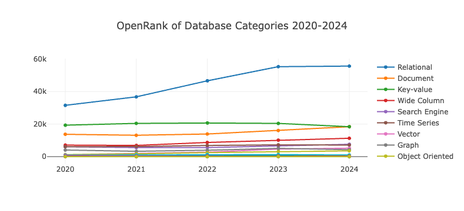
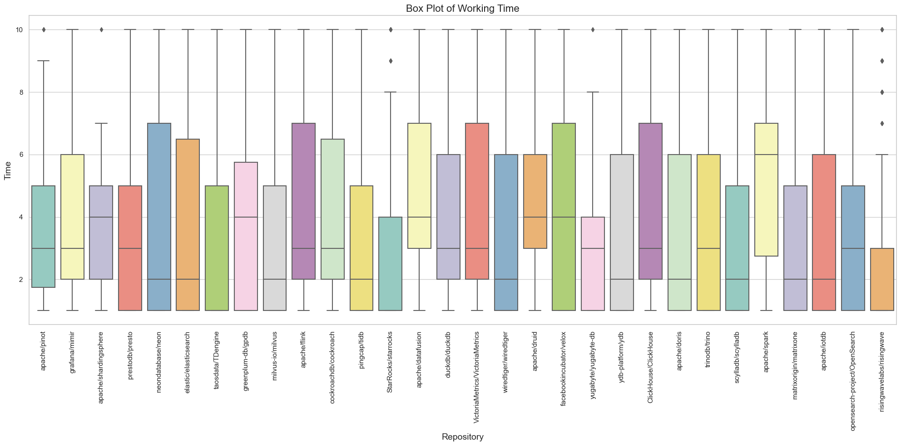
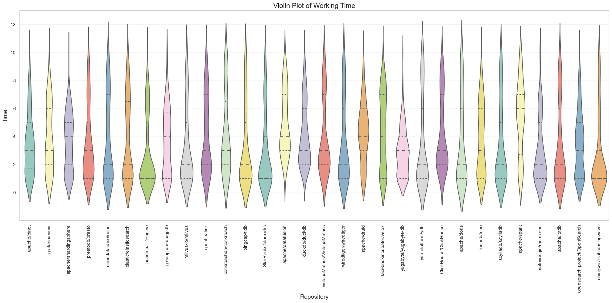
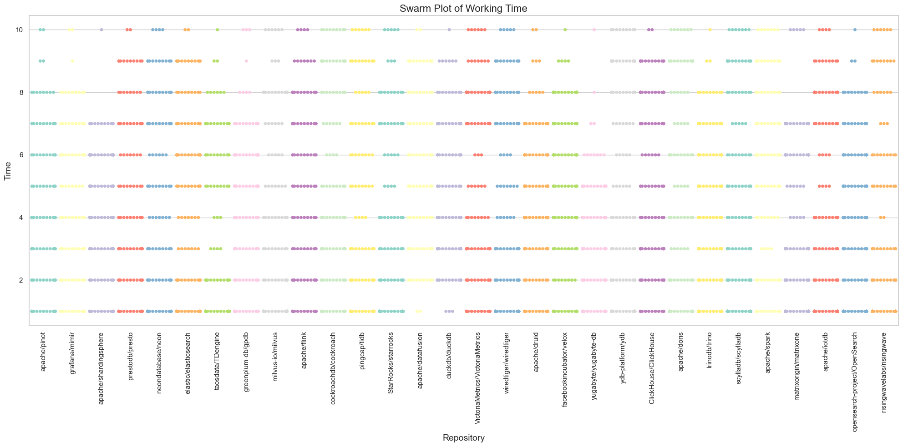
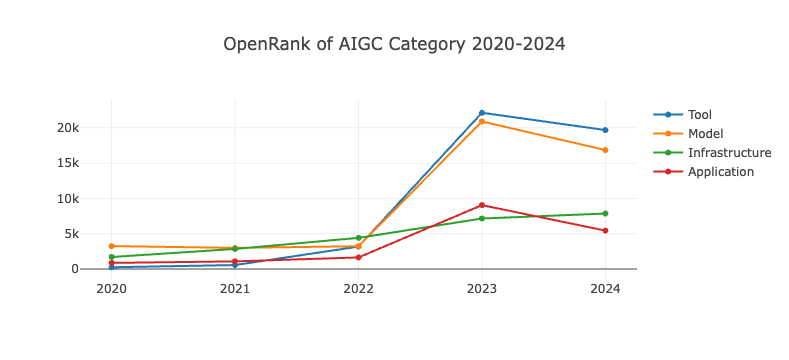
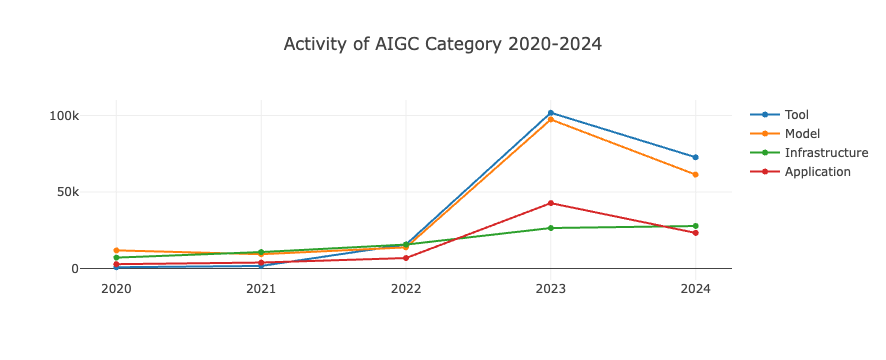
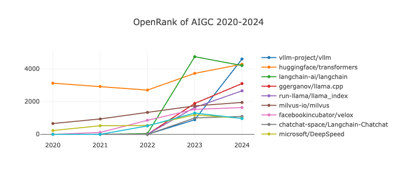
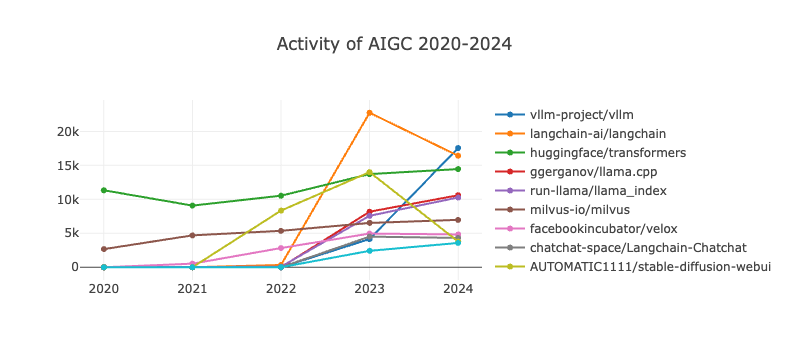

## 六. 开源项目洞察

2024年，在历经了一段时间的AI大模型、生成式AI的井喷式发展，以及新一轮数据库领域的发展热潮，开源项目当中的各类产品展现了新的发展面貌。本章节基于开源项目视角驱动，通过对开源项目的各维度数据进行分析，获得更加广泛的洞察视角。并且，通过对各类开源项目的Topic进行统计分析，展示了全局开源社区在2024年所展现的统一兴趣。

### 6.1 项目类型

本小节选取了 GitHub 活跃度排名前 10,000 的仓库数据进行统计分析。

#### 6.1.1 不同项目类型数量比例

图 6.1 不同项目类型数量比例

- 组件框架类型（Libraries and Frameworks）占比最高（31.36%），充分反映了开源协同创新特点（站在巨人的肩膀上），也是最受开发者喜爱、乐于贡献的类型；
- 应用软件类型（Application Software）由于其实用性，占比仅次于组件框架类（24.34%），能够使得所有用户（不仅仅局限于开发者）在各个行业与领域使用开源软件；
- 内容资源类型（Non Software）也有不小的占比（23.17%），这体现了开源这一协同开发模式从软件延伸到全内容领域的趋势，包括文档、教育、艺术、硬件或其他非编程相关领域的创作和贡献；
- 软件工具类型（Software Tools）的占比为 18.9%，对于开发者这个专业群体来说，是个不容忽视的比例，能够使开发者专注于构建实际的应用程序和软件产品；
- 系统软件类型（System Software）占比最少（仅 2.3%），体现了基础软件的性质，数量虽少，但价值巨大，难度也是最高的。

#### 6.1.2 不同项目类型 OpenRank 加总比例

图 6.2 不同项目类型 OpenRank 加总比例

进一步，再从 OpenRank 影响力视角看这几个类别：

- 最大的变化，就是内容资源类型（Non Software）项目虽然有较高的活跃度，但其影响力相对较低；
- 而系统软件类型（System Software）虽然活跃度占比很少，但其影响力占比相对更多，软件工具类型（Software Tools）项目也有类似的现象；
- 组件框架类型和应用软件类型则没有太多变化，都是属于占比较多的类型。

#### 6.1.3 不同项目类型近 5 年 OpenRank 变化趋势

图 6.3 不同项目类型近 5 年 OpenRank 变化趋势

从上面的五年 OpenRank 演化图上可以看得出来，系统软件类型（System Software）的影响力也是逐年升高、而内容资源类型（Non Software）项目的影响力比例是在相对下降这样一个现象。

### 6.2 项目 Topic 分析

本节同样选取 GitHub 活跃度排名前 10,000 的仓库数据进行分析，并获取仓库下的 Topic 标签进行深入洞察。

#### 6.2.1 热门 topic

图 6.4 出现次数前十的 Topic

前十的主题涵盖了多个领域，反映了开源社区的广泛兴趣。其中，JavaScript、Hacktoberfest、Python 等主题代表了前沿技术、活跃社区活动和多用途编程语言的热点，突显了对于前端开发、开源贡献和多领域编程的关注。

#### 6.2.2 热门 Topic 的仓库总 OpenRank 趋势

图 6.5 出现次数前十的 Topic 下仓库的 OpenRank 变化 (2019 - 2023)

- Hacktoberfest 是一个每年十月举办的活动，旨在促进开源社区的发展。它由 DigitalOcean 与 GitHub 合作发起，其目标是鼓励更多人参与开源项目，为开源社区做出贡献。它的 OpenRank 高反映了人们对于开源项目、社区参与和贡献的热情。开发者们积极参与这个活动，通过向开源项目提交 Pull Request 的方式贡献，从而帮助提升了这个仓库的声誉和影响力。
- JavaScript 和 Python：这两项技术在过去几年中保持了相对稳定的趋势，没有出现大幅度的增长或下降。

### 6.3 数据库领域项目分析

#### 6.3.1 数据库各子领域近五年增长趋势

    图 6.18 数据库各子领域 2020 - 2024 年 OpenRank 变化趋势

    图 6.18 数据库各子领域 2020 - 2024 年 活跃度变化趋势

+ 数据库各子领域的发展相对平稳，在过去的五年中，关系型数据库独占鳌头。在2024年虽然发展相对放缓，但依然展现了足够的统治力
+ 键值类型数据库在2024年的影响力与活跃度有所降低，并且在一定程度上被文档型数据库追平甚至有所超越。
+ 文档行数据库在过去的发展中保持了稳定的上升。前三名的数据库子领域的两项指标累计均占数据库领域两项指标的 70% 以上。

#### 6.3.2 开源数据库项目工作活跃时间分析

此处将根据开源数据库项目 OpenRank Top 30 在 2024 全年中的事件按事件分布情况的打孔数据，观察项目的工作时间分布情况。

    图 6.18 数据库开源项目工作时间箱型图

    图 6.18 数据库开源项目工作时间小提琴图

    图 6.18 数据库开源项目工作时间蜂巢图

+ 根据箱型图的时间分布数据可以看出，绝大多数的数据库项目的中位数工作时间都集中在2-5的时间段。活跃时间有同一性
+ 根据小提琴图以及蜂巢图进行更细致的时间分析可以发现，在2时间段左右的时间中，数据库项目普遍最活跃。并且大部分项目都存在两个峰值工作时间，一个主峰一个次峰。可能与大部分数据库类型的项目都存在公司背景有关系。

#### 6.3.3 数据库子领域 OpenRank 榜单和活跃度 Top 10 榜单

    表 6.3 数据库子领域  OpenRank 排行

| 排名 |   子领域名称    | OpenRank |
| :--: | :-------------: | :------: |
|  1   |   Relational    | 55635.51 |
|  2   |    Document     | 18384.45 |
|  3   |    Key-value    | 18376.55 |
|  4   |   Wide Column   | 11294.02 |
|  5   |  Search Engine  | 7589.15  |
|  6   |   Time Series   | 7120.22  |
|  7   |     Vector      | 5208.63  |
|  8   |      Graph      |  4281.4  |
|  9   | Object Oriented | 3557.65  |
|  10  |  Hierarchical   | 1036.42  |
|  11  |       RDF       |  433.08  |
|  12  |      Array      |  344.02  |
|  13  |      Event      |  281.65  |
|  14  |     Spatial     |  239.08  |
|  15  |    Columnar     |  228.52  |
|  16  |   Native XML    |  132.76  |
|  17  |     Content     |  25.65   |

    表 6.3 数据库子领域  活跃度排行

| 排名 |   子领域名称    | activity  |
| :--: | :-------------: | :-------: |
|  1   |   Relational    | 165677.16 |
|  2   |    Document     | 57491.37  |
|  3   |    Key-value    | 56071.49  |
|  4   |   Wide Column   | 32835.39  |
|  5   |  Search Engine  | 24881.79  |
|  6   |   Time Series   | 22610.51  |
|  7   |     Vector      | 17463.42  |
|  8   |      Graph      |   13128   |
|  9   | Object Oriented | 10190.06  |
|  10  |  Hierarchical   |  3021.28  |
|  11  |       RDF       |  1405.37  |
|  12  |      Array      |  1009.34  |
|  13  |     Spatial     |  812.11   |
|  14  |      Event      |  735.62   |
|  15  |    Columnar     |  568.63   |
|  16  |   Native XML    |   549.4   |
|  17  |     Content     |   77.83   |

从数据库领域各子领域 2024 年的 OpenRank 和活跃度排行可以看出：

- Relational、Key-value、Document 在以上两项指标中都稳据前三，前三名的数据库子领域的两项指标累计均占数据库领域两项指标的 70% 以上；
- Relational 的各项指标超过了第二至第五名的总和，其两项指标均占数据库领域两项指标的 40% 以上，是一个超大子类。
- Columnar作为新加入榜单的数据库项目发展势头迅猛
- 向量数据库在2024年也有了显著的提升。

### 6.4 生成式 AI 领域项目分析

在经历了新的一年的行业发展，生成式AI展现了新的发展样态。

#### 6.4.1 生成式AI各子领域近五年增长趋势

图 6.18 生成式 AI 各子领域 2020 - 2024 年 OpenRank 变化趋势

图 6.19 生成式 AI 各子领域 2020 - 2024 年 活跃度 变化趋势

+ 对于不同种类别的划分的分类分析，各类生成式AI项目的活跃度与影响力都出现了一定程度的回落。
+ 工具类AIGC开源项目的影响力与活跃度均显著高于模型类和应用类
+ 模型类项目影响力自 2022 年开始增长迅速，在 2023 年超过基础类，整体呈现上升趋势，代表着 2023 年是 AIGC 创新应用开发的大爆发之年，而2024年发展放缓，这可能体现了在过去一段时间中，生成式AI的发展相对趋于稳定。

#### 6.4.2 生成式 AI 领域项目 OpenRank 和活跃度 Top 10 变化趋势

图 6.20 生成式 AI 领域 OpenRank Top 10 项目近 5 年变化趋势

图 6.21 生成式 AI 领域 活跃度 Top 10 项目近 5 年变化趋势

- vllm 影响力和活跃度双排名第一，备受开发者的关注；
- langchain 的影响力以及活跃度排名在新的一年有所回落，但是依然保持了相当高的排名。
- transformers 作为从问世以来的新时代AI的基石，在最新一年中依然保持了极高的关注度，面对新的诸如mamba等最新架构的挑战，transformer依然是当下大模型AI的核心。
- stable-diffusion-webui在2023年展现了非常强大的发展势头，曾被认为是transformer的有力挑战者，但其在2024年的各种指标的发展都有所降低，依然没有动摇transformer的地位。
- Langchain-Chatchat作为一个本地部署的知识库，在2024年依然保持了稳定上升的发展态势。 

#### 6.4.3 2023 年生成式 AI 领域项目 OpenRank 和活跃度 Top 10 榜单

    表 6.3 生成式 AI 领域 OpenRank 度排行

| 排名 | 项目名称                          | OpenRank |
| ---- | --------------------------------- | -------- |
| 1    | vllm-project/vllm                 | 4611     |
| 2    | huggingface/transformers          | 4212.26  |
| 3    | langchain-ai/langchain            | 4292.13  |
| 4    | ggerganov/llama.cpp               | 3110.07  |
| 5    | run-llama/llama_index             | 2665.89  |
| 6    | milvus-io/milvus                  | 1955.52  |
| 7    | facebookincubator/velox           | 1641.14  |
| 8    | chatchat-space/Langchain-Chatchat | 1097.79  |
| 9    | microsoft/DeepSpeed               | 983.42   |
| 10   | invoke-ai/InvokeAI                | 971.2    |

    表 6.4 生成式 AI 领域 活跃度排行

| 排名 | 项目名称                             | OpenRank |
| ---- | ------------------------------------ | -------- |
| 1    | vllm-project/vllm                    | 17556.02 |
| 2    | langchain-ai/langchain               | 16413.39 |
| 3    | huggingface/transformers             | 14454.74 |
| 4    | ggerganov/llama.cpp                  | 10599.61 |
| 5    | run-llama/llama_index                | 10272.5  |
| 6    | milvus-io/milvus                     | 6978.76  |
| 7    | facebookincubator/velox              | 4832.71  |
| 8    | chatchat-space/Langchain-Chatchat    | 4315.73  |
| 9    | AUTOMATIC1111/stable-diffusion-webui | 3782.55  |
| 10   | getcursor/cursor                     | 3579.97  |